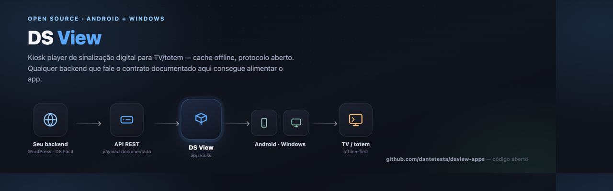

# DS View — apps para TV



Código aberto, licença [MIT](LICENSE). Gostou do projeto? **Pix / PayPal:** `dante.testa@gmail.com` — sem
pressão, é só um "obrigado" opcional.

**DS View** é um player de sinalização digital para TV/totem: abre uma playlist em tela cheia, baixa o
conteúdo para o aparelho e continua tocando mesmo sem internet. Código aberto, para qualquer backend que
implemente o contrato de API descrito abaixo — não é preso a nenhum produto específico.

## Por que existe

Este repositório não guarda nenhuma lógica de negócio (login, planos, upload, agendamento — isso é do seu
backend). Ele é só a **casca que toca conteúdo na TV**: kiosk full-screen, cache local, hot-reload, retomada
após queda de energia. A ideia é que qualquer sistema de sinalização digital (o seu, não necessariamente o
nosso) possa expor os dois endpoints HTTP documentados na seção [Documentação da API](#documentação-da-api--contrato-do-payload)
e usar o DS View como player, sem escrever um app de TV do zero.

A implementação de referência é o [DS Fácil](https://dsfacil.com.br) (plugin WordPress, código fechado) —
citado aqui só como exemplo de backend compatível, não como dependência.

## Os apps

| Pasta | O que é | Roda em |
|---|---|---|
| [`android/`](android/) | App Kotlin com WebView + servidor local (NanoHTTPD) | Android 5.0+, incluindo Android TV e TV Box |
| [`windows/`](windows/) | App Electron com o mesmo desenho de cache local | Windows 10 e 11 |

Os dois usam a mesma arquitetura: um servidor em `127.0.0.1` imita a API da playlist, o player conversa só
com ele, e um laço de sincronização espelha as mídias no disco. Por isso funcionam offline depois do
primeiro download.

### Baixar pronto

Não é preciso compilar nada para usar — os links abaixo sempre apontam para a última versão publicada:

**[⬇ Baixar para Android](../../releases/latest/download/dsview-android.apk)** ·
**[⬇ Baixar para Windows](../../releases/latest/download/dsview-windows-setup.exe)** ·
[ver todas as versões](../../releases)

### Compilar

**Android**

```bash
cd android
./gradlew assembleDebug      # gera app/build/outputs/apk/debug/app-debug.apk
```

**Windows**

```bash
cd windows
npm install
npm start                    # roda em modo desenvolvimento
npm run dist                 # gera o instalador NSIS em dist/
```

### Player

O arquivo `player.js` (e o `player.css`) **não vive aqui**. Ele é copiado no build a partir do servidor de
playlists, para que os dois apps e a página web toquem exatamente o mesmo player. A cópia é ignorada pelo
git de propósito: nunca edite os arquivos em `android/app/src/main/assets/` nem em `windows/src/renderer/`
— a correção é sempre na origem (o seu backend, se você estiver rodando o seu próprio player).

O build também limpa os comentários de cabeçalho da cópia, para o app sair neutro.

## Documentação da API / contrato do payload

Isto é a especificação que **qualquer backend** precisa implementar para funcionar com o DS View. É o
mesmo contrato usado pela implementação de referência (dsfacil.com.br) — dois endpoints HTTP públicos
(sem autenticação por cookie/token de API; a "senha" é por playlist, ver abaixo), namespace livre — os
apps montam a URL a partir do que você configurar no setup (`origin` + `token`).

### `GET /player/{token}`

Estado atual da playlist. É o endpoint de **polling** (o player chama a cada ~45-60s, com jitter) e também
o de **heartbeat** (contabiliza o player como "no ar" quando o `device` bate).

**Query string:**

| Parâmetro | Obrigatório | Descrição |
|---|---|---|
| `t` | não | cache-buster (`Date.now()`) — o servidor deve responder sempre `no-store`, nunca cache HTTP |
| `device` | não | `device_token` emitido por `/auth` numa sessão anterior. Sem ele, uma playlist com senha responde `password` |

**Resposta `200`:**

```json
{ "status": "ok", "payload": { /* ver "Objeto payload" abaixo */ } }
```

```json
{ "status": "password" }
```

```json
{ "status": "expired", "title": "Plano expirado", "message": "Texto configurável." }
```

**Resposta `404`** (token inexistente ou playlist desativada), no formato padrão de erro do WordPress REST:

```json
{ "code": "dsf_notfound", "message": "Playlist não encontrada.", "data": { "status": 404 } }
```

### `POST /player/{token}/auth`

Autentica o player: valida a senha (se a playlist tiver uma) e emite um `device_token` de **sessão eterna**
— o app grava esse token e nunca mais precisa reenviar a senha naquele aparelho, a menos que a senha seja
trocada ou o link seja rotacionado no painel (isso revoga todos os `device_token` emitidos).

**Corpo (`application/json`):**

```json
{ "password": "" }
```

`password` vazio é válido e esperado quando a playlist não tem senha — o player sempre chama `/auth` pelo
menos uma vez, mesmo sem senha, só para receber o `device` e contar como "no ar".

**Resposta `200`, playlist sem senha ou senha correta:**

```json
{ "status": "ok", "device": "a1b2c3...", "payload": { /* ver "Objeto payload" */ } }
```

**Resposta `200`, senha incorreta ou ausente:**

```json
{ "status": "password" }
```

**Resposta `200`, assinante/conta sem permissão de tocar (plano expirado etc.):**

```json
{ "status": "expired", "title": "Plano expirado", "message": "Texto configurável." }
```

**Resposta `429`** se a implementação de referência aplicar rate-limit nas tentativas de senha (recomendado:
algo como 12 tentativas / 10 min por token), mesmo formato de erro do `404` acima com `data.status = 429`.

**Resposta `404`**, mesmo formato do `GET`, se o token não existir.

### Objeto `payload`

```json
{
  "id": 42,
  "title": "Cardápio — Loja Centro",
  "transition": "fade",
  "orientation": 0,
  "version": "9f8c1a2b3d4e5f60718293a4b5c6d7e8",
  "queue": [
    {
      "kind": "image",
      "src": "https://exemplo.com/uploads/foto1.webp",
      "duration": 12,
      "fit": "cover"
    },
    {
      "kind": "video",
      "provider": "self",
      "src": "https://exemplo.com/uploads/video1.mp4",
      "external_id": null,
      "duration": null,
      "fit": "cover",
      "audio": false
    },
    {
      "kind": "video",
      "provider": "youtube",
      "src": null,
      "external_id": "dQw4w9WgXcQ",
      "duration": 30,
      "fit": "contain",
      "audio": true
    },
    {
      "kind": "weather",
      "template": "today_3days",
      "theme": "sunset",
      "location_name": "São Paulo, São Paulo",
      "duration": 15,
      "current": { "temp": 24, "icon": "partly-cloudy", "label": "Parcialmente nublado", "humidity": 65, "wind": 12 },
      "days": [
        { "weekday": "Qui", "icon": "rain", "label": "Chuva", "max": 24, "min": 17 }
      ],
      "sig": "-23.55_-46.63|today_3days|sunset|2026-08-11 15:00:00"
    }
  ]
}
```

| Campo | Tipo | Descrição |
|---|---|---|
| `id` | number | identificador da playlist no backend. Não usado pelo player de referência hoje; presente para consumidores que queiram distingui-la. |
| `title` | string | nome da playlist. Não é exibido pelo player de referência hoje (reservado para casca/UI). |
| `transition` | string | efeito entre itens, um de `fade` \| `none` \| `slide`. **O player de referência (`player.js`) hoje ignora este campo e sempre faz um fade de 0.7s** — está no payload para consumidores próprios que queiram diferenciar. |
| `orientation` | number | rotação da tela em graus: `0` \| `90` \| `180` \| `270`. O player aplica isso via classe CSS (`dsf-rot-90` etc.) na hora, mesmo com conteúdo já tocando. |
| `version` | string | hash (o backend de referência usa `md5`) que muda sempre que o conteúdo **efetivo agora** muda — inclui edições E agendamento ligando/desligando itens. É a chave do hot-reload: o player só troca a fila **na fronteira do próximo item** quando `version` muda (nunca corta o item atual no meio), exceto se o item que está tocando agora sumiu da fila nova (aí troca na hora). Os apps também usam `version` para decidir se precisam baixar mídia nova. |
| `queue` | array | a fila **já achatada e resolvida** — galerias já viraram N imagens, playlists aninhadas já foram expandidas, agendamento já foi avaliado no fuso da playlist. O player não sabe (nem precisa saber) que um item veio de uma galeria ou de uma sub-playlist. |

**Item de imagem** (`kind: "image"`):

| Campo | Tipo | Descrição |
|---|---|---|
| `kind` | `"image"` | — |
| `src` | string | URL da imagem |
| `duration` | number | segundos em tela, mínimo 1 |
| `fit` | `"cover"` \| `"contain"` | `cover` corta para preencher a tela; `contain` mostra a imagem inteira |

**Item de vídeo** (`kind: "video"`):

| Campo | Tipo | Descrição |
|---|---|---|
| `kind` | `"video"` | — |
| `provider` | `"self"` \| `"youtube"` \| `"vimeo"` | origem do vídeo |
| `src` | string \| null | URL do arquivo, só quando `provider = "self"`; `null` para YouTube/Vimeo |
| `external_id` | string \| null | ID do vídeo no YouTube/Vimeo; `null` quando `provider = "self"` |
| `duration` | number \| null | segundos até avançar; `null` = tocar **até o fim** (o player detecta o fim real do arquivo/embed) |
| `fit` | `"cover"` \| `"contain"` | mesma semântica da imagem |
| `audio` | boolean | se `true`, o vídeo toca com som **depois que o usuário/app liberar áudio** (navegadores só permitem som após um gesto — os apps de TV simulam esse gesto na inicialização) |

**Item de clima** (`kind: "weather"`) — mídia dinâmica, sem arquivo. Os dados já vêm **resolvidos** pelo
backend (ícone e rótulo já traduzidos, sem código meteorológico cru) — o player só monta o card, nunca
faz chamada de API própria:

| Campo | Tipo | Descrição |
|---|---|---|
| `kind` | `"weather"` | — |
| `template` | `"today"` \| `"today_3days"` | `today` mostra só a condição atual; `today_3days` acrescenta a previsão dos 3 dias seguintes |
| `theme` | `"slate"` \| `"sunset"` \| `"dawn"` \| `"ocean"` \| `"forest"` \| `"aurora"` \| `"custom"` | paleta do gradiente de fundo do cartão, escolhida no editor. Os 6 primeiros são gradientes fixos em CSS (`.dsf-weather-theme-*`); `"custom"` usa `custom_colors` abaixo em vez de CSS |
| `custom_colors` | array de strings | só presente/relevante quando `theme = "custom"` — de 2 a 6 cores hex (`#RRGGBB`) escolhidas pelo usuário; o player de referência monta `linear-gradient(135deg, ...)` a partir delas via `style` inline, não CSS |
| `location_name` | string | nome do local pra exibir (ex.: "São Paulo, São Paulo") |
| `duration` | number | segundos em tela, mínimo 1 |
| `current` | object \| null | `{ temp, icon, label, humidity, wind }` — `icon` é uma chave curta (`sun`, `partly-cloudy`, `cloudy`, `fog`, `drizzle`, `rain`, `snow`, `storm`), não um código meteorológico numérico |
| `days` | array | só presente/relevante em `today_3days`; cada item é `{ weekday, icon, label, max, min }` |
| `sig` | string | identidade estável do conteúdo do item (localização + template + timestamp da última consulta) — como este `kind` não tem `src`/`external_id`, um consumidor próprio deve usar `sig` (não `kind+src`) para detectar "este item específico mudou" no hot-reload |

### Recomendações para quem implementar um backend compatível

- **Sempre responda `no-store`** nos dois endpoints — o player faz polling constante e qualquer cache
  intermediário (CDN, proxy, service worker do seu site) trava a TV num estado velho.
- **`version` precisa mudar em toda alteração de conteúdo efetivo**, incluindo agendamento entrando/saindo
  de janela — é o único sinal que os apps usam para saber se precisam baixar mídia nova.
- **`device_token` deve ser eterno até ser revogado explicitamente** (troca de senha, rotação do link).
  É o que permite a TV nunca mais pedir senha depois da primeira vez.
- Itens que já saíram da fila (deletados, fora de agendamento) simplesmente **não aparecem** em `queue` —
  não existe soft-delete nem flag "desabilitado" no payload público.

## Como o app usa isso (cache-proxy)

Os dois apps não falam com o seu backend diretamente na hora de tocar. Cada um sobe um servidor HTTP em
`127.0.0.1` que **imita a forma** dos dois endpoints acima (rotas locais `/state` e `/state/auth`); o
`player.js` fala só com esse servidor local, que por trás consulta o backend real a cada ciclo de
sincronização, baixa a mídia nova para o disco e reescreve as URLs de `queue[].src` para arquivos locais.
Se a internet cair, o servidor local continua respondendo com a última versão boa em disco — por isso o
player nunca percebe a queda.

Ver `windows/src/main/{server,sync,config,resolve}.js` e o equivalente Kotlin em
`android/app/src/main/java/com/dsview/player/{LocalServer,Syncer,Config,Resolver}.kt` para a implementação.

## Contribuindo

Pull requests são bem-vindos. Cada app tem seu próprio `CLAUDE.md` (`android/CLAUDE.md`,
`windows/CLAUDE.md`) com o mapa de arquitetura, convenções e gotchas conhecidos — vale ler antes de mexer.

Como os dois apps implementam a mesma arquitetura (cache-proxy) em duas linguagens diferentes, uma mudança
de comportamento normalmente precisa ser replicada nos dois.

## Licença

[MIT](LICENSE) — use, modifique, redistribua, incorpore no seu próprio produto, sem pedir permissão.
A única exigência é manter o aviso de copyright (autor + link) nas cópias.

## Apoie o projeto

Se o DS View te ajudou, um apoio é bem-vindo (e opcional — o projeto continua livre de qualquer forma):

- **Pix:** `dante.testa@gmail.com`
- **PayPal:** `dante.testa@gmail.com`
